# Car Rental System

## 🔐 Login Page

The login page is used to authenticate users before accessing the system. Roles Manager, Secretary are validated against the database.

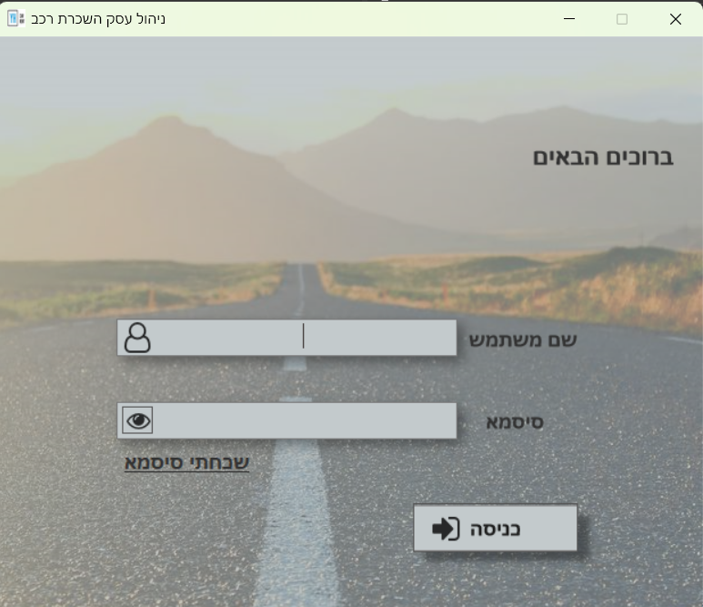

Users must enter a valid username and password. On successful login, they are redirected to the appropriate dashboard based on their role.

## 🔐 Password Management

This screen handles all password-related operations in the system and is used in three scenarios:

1. **First-Time Login (New Employee)**  
   - The employee logs in with their ID as a temporary password.
   - They are required to create a secure password and set answers to security questions for future identity verification.

2. **Forgotten Password**  
   - The user is prompted to answer three predefined security questions.
   - If the answers are correct, they proceed to create a new password.

3. **Scheduled Password Reset (Every 6 Months)**  
   - Every user is required to update their password every 6 months.
   - The system verifies their identity using the saved answers to security questions before allowing the reset.

### 🖼️ Screenshots

**Step 1: Answering Security Questions**

The user must provide correct answers to continue to the password reset screen.

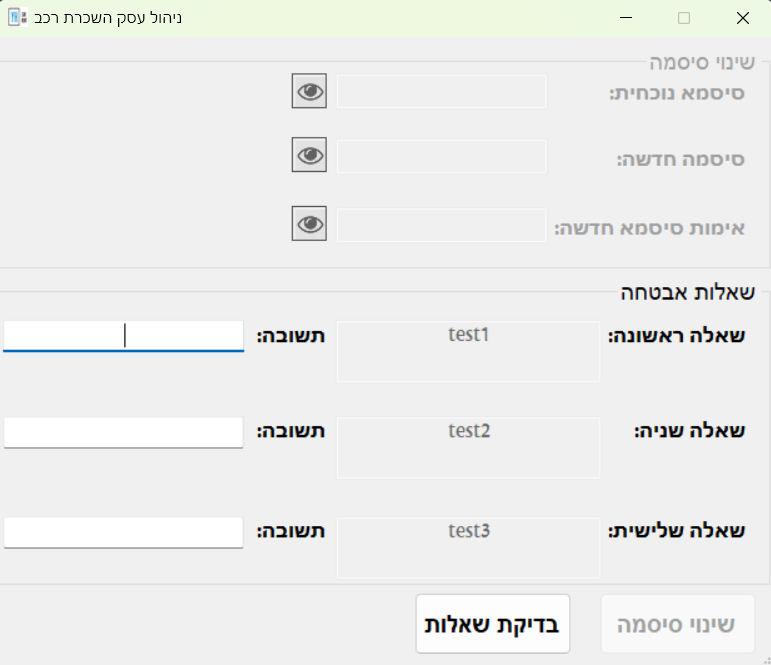

---

**Step 2: Enter New Password**

After successful verification, the user is asked to enter and confirm a new password.

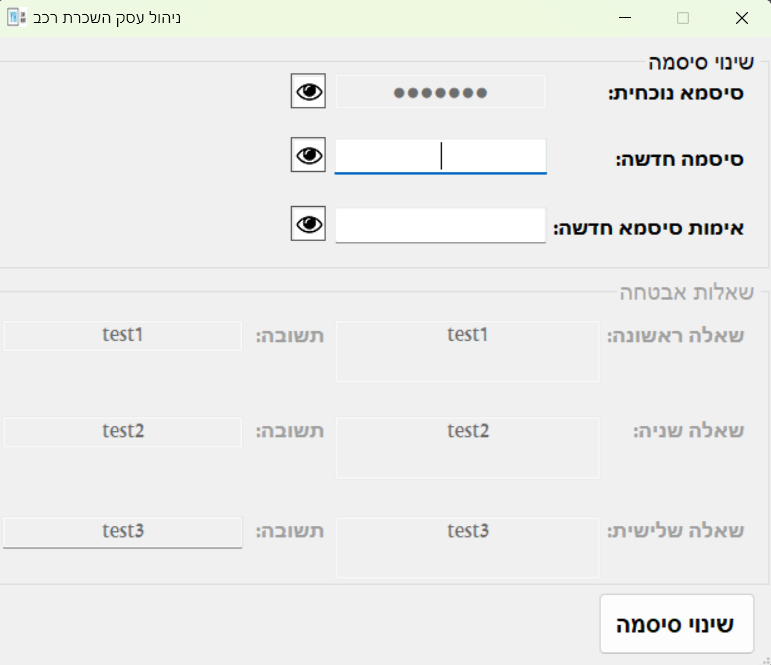

## 📊 Main Dashboard (Manager & Secretary View)

After login, users are taken to their role-based dashboard. Both managers and secretaries see the list of active rentals, clients, vehicles, and key details for daily operations.

This dashboard is the central hub of the system and allows both roles to:
- View all current rentals and associated clients
- Access client and vehicle information
- View and filter reminders and notifications (like license/insurance expiration dates)
- Perform vehicle return and rental operations

The difference between the manager and secretary interface is mainly in **access control** — the manager has more permissions for user management and system settings.

---

### 👨‍💼 Manager Dashboard View

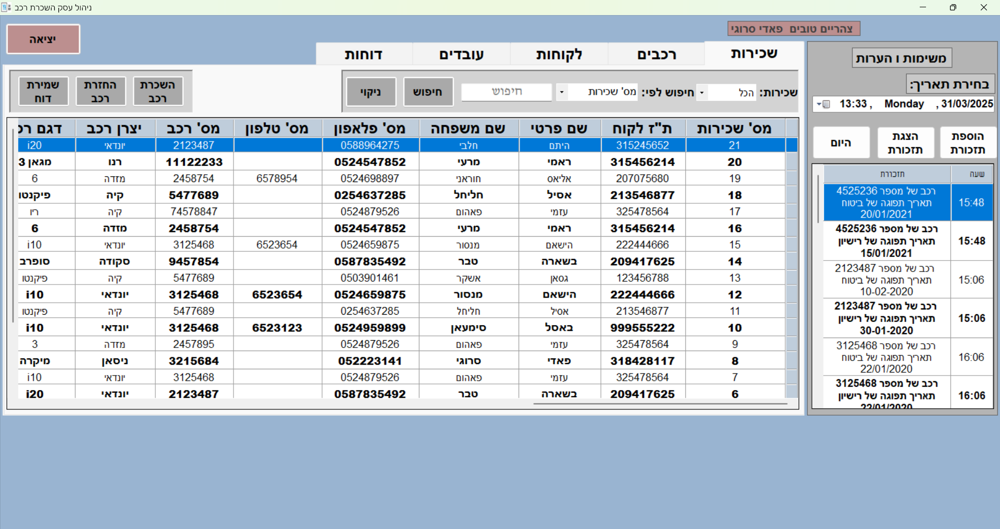

---

### 👩‍💼 Secretary Dashboard View

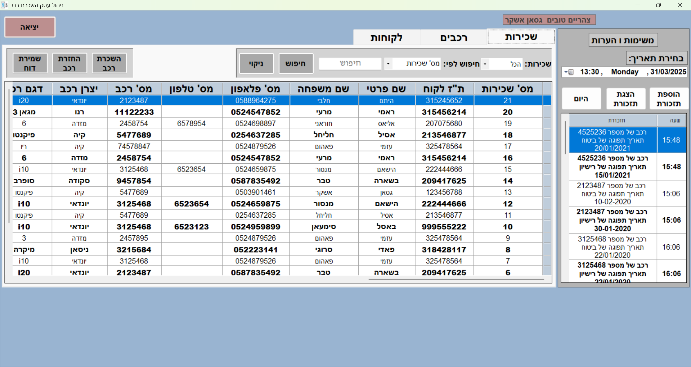

## 📋 Notes Tab & 🚗 Rent Tab Overview

The main dashboard is divided into key functional sections for efficient task handling by both managers and secretaries.

---

### 📝 Notes Tab (Right Side)

The **Notes Tab** allows employees to manage reminders and internal communication.

**Main Features:**
- 📅 **Date picker** to filter notes by day
- ➕ **Add notes** manually (e.g. reminders or messages)
- 🔄 **Update existing notes** if something changes
- 👁️ **Review all previous notes** sorted by time
- 📌 Shared visibility: **All notes are visible to all users** across the system

---
## 🧭 System Tabs Overview
The Car Rental System is divided into several functional tabs designed to simplify daily operations and ensure data is organized, accessible, and secure. Each tab is role-based — certain sections are only visible to the manager.

### 🚗 Rent Tab (Main Area)

The **Rent Tab** is the core of the system for handling rental operations.
It is accessible to **both managers and secretaries**, providing a shared workspace to manage the entire car rental process.

**Main Features:**
- 🔍 **Search Rentals** — filter by rental number, customer ID, or vehicle number
- 👁️ **Review Rental Records** — view all current and past rental data
- ➕ **Add New Rental** — select a customer and available car to start a rental
- 🔄 **Update Rental** — modify active rental details (duration, car, client info)
- 🔚 **Return Vehicle** — mark a car as returned and update its availability
- 🧾 **Print Rental Reports** — generate reports for record keeping or clients

---

### 🖼️ Interface Overview

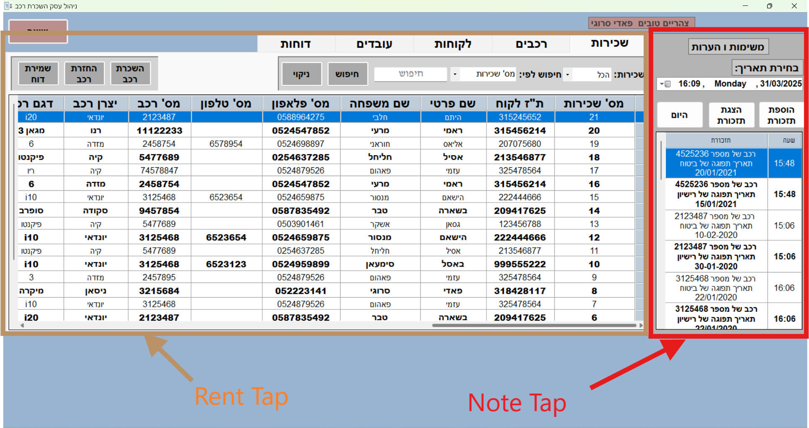
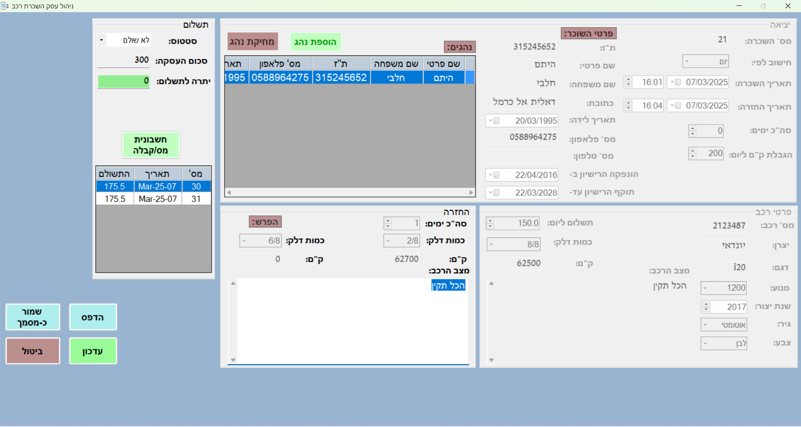
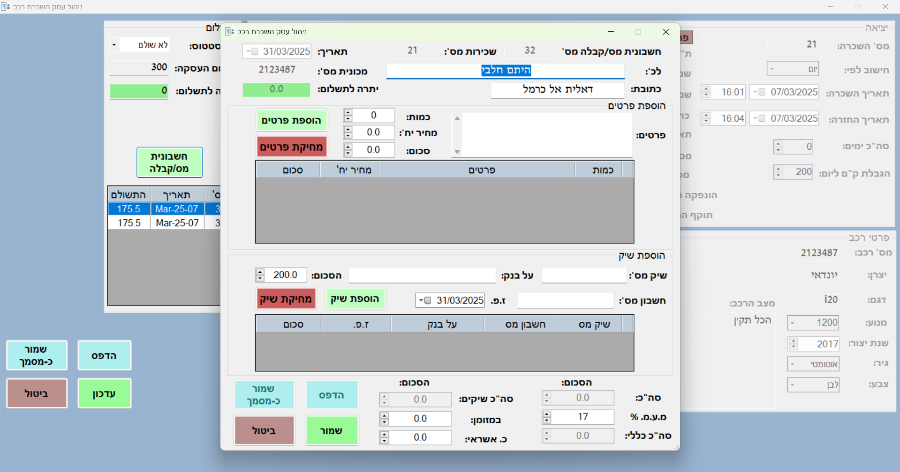

---

### 🚗 Car Tab

This tab allows both managers and secretaries to access vehicle-related data, but with different permission levels.

- The **manager** has full control over vehicle management.
- The **secretary** can only **search and view** vehicle information.

**Manager Features:**
- 🔍 **Search Cars** using model, plate number, or manufacturer
- ➕ **Add New Car** to the system
- 🛠️ **Update Car Details** such as model, year, and availability
- ❌ **Delete Car** from the system if it's no longer in use

**Secretary Features:**
- 🔍 **Search Cars** only — no edit, delete, or add permissions

📷 Screenshot:  
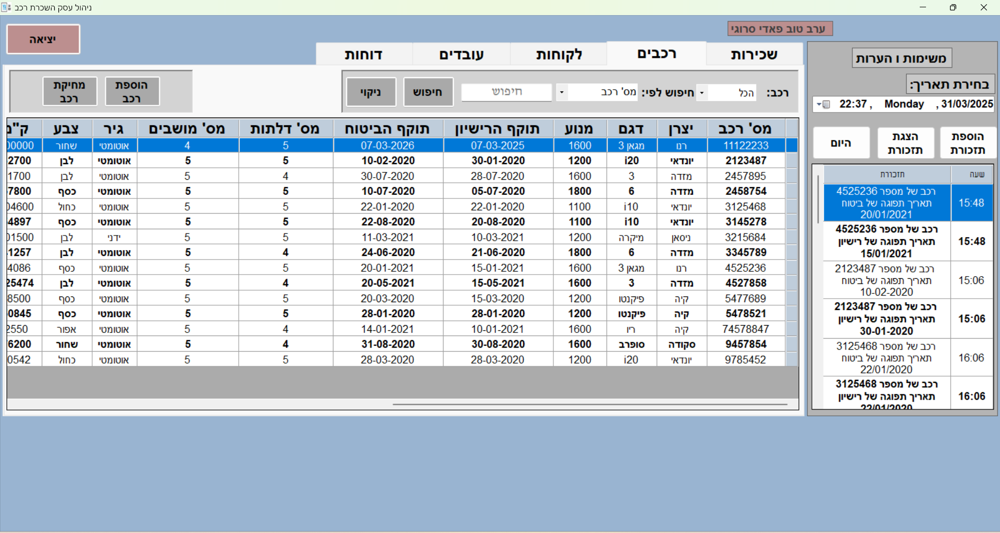
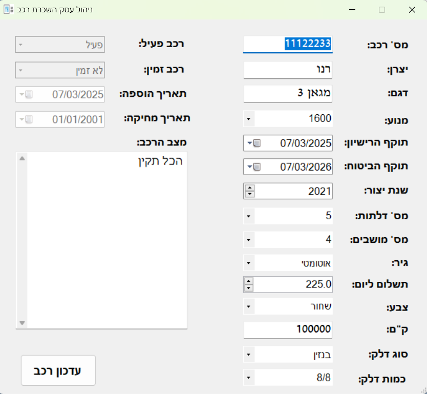

---

### 👤 Client Tab

This tab handles all client management and rental history. It is accessible to both managers and secretaries.

**Main Features:**
- 🔍 **Search Clients** by name, ID, or contact number
- ➕ **Add New Client** with full personal and license details
- ✏️ **Update Client** data when needed
- 💾 **Save Client Report** with history and rental details
- 🖨️ **Print Client Report** for documentation or legal use

📷 Screenshot:  
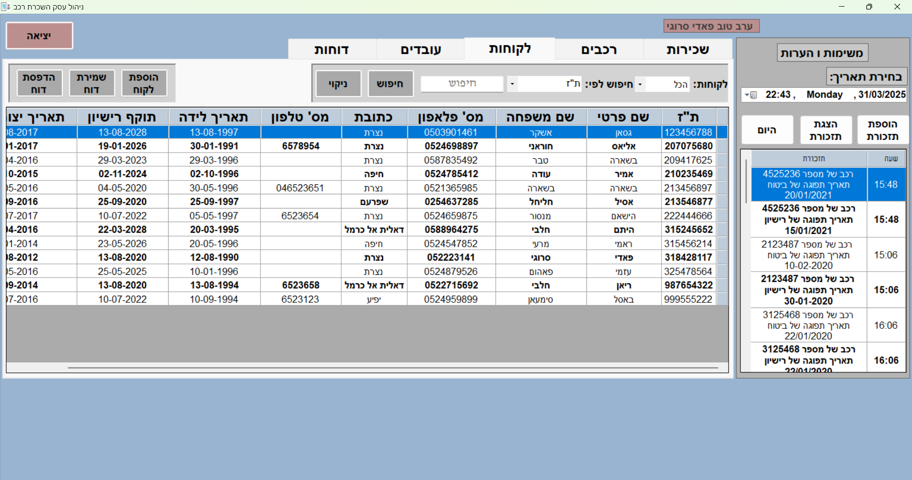
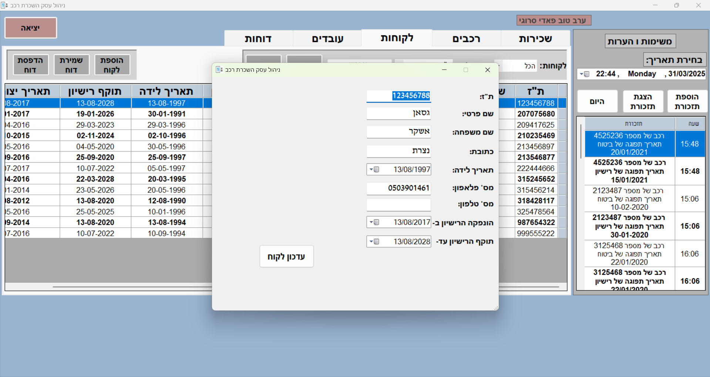

---

### 👥 Employees Tab *(Manager Only)*

Visible only to the manager, this tab is used to manage employee accounts and system access.

**Main Features:**
- 🔍 **Search Employees** by name, role, or ID
- ➕ **Add New Employee** (assigning default login and role)
- ✏️ **Update Employee** information
- 💾 **Save Employee Report** for record keeping and evaluation

📷 Screenshot:  
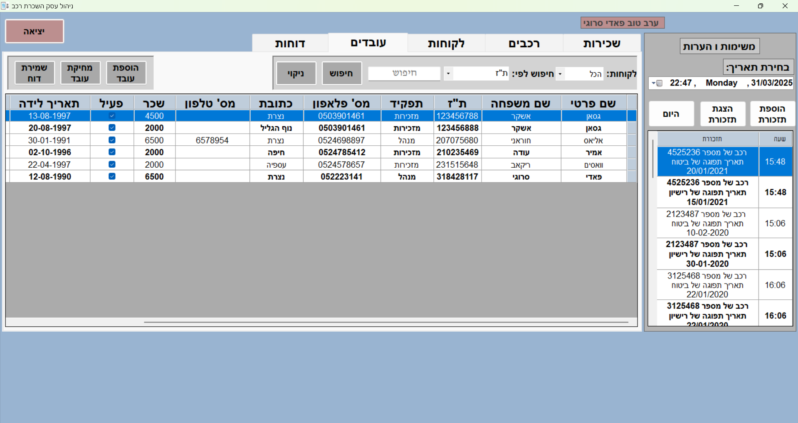
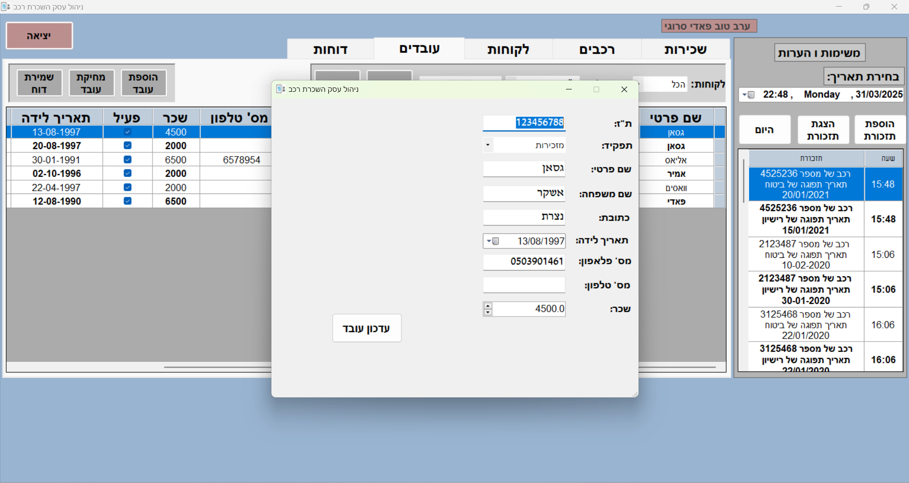

---

### 📊 Reports Tab *(Manager Only)*

This powerful section gives managers a full view of business performance through reports.

**Main Features:**
- 🔍 **Search Reports** for cars, employees, and system activity
- 💾 **Save Reports** for offline access
- 🖨️ **Print Reports** for:
  - 🚘 Car activity/performance
  - 👥 Employee performance
  - 📈 Overall business metrics

📷 Screenshot:  
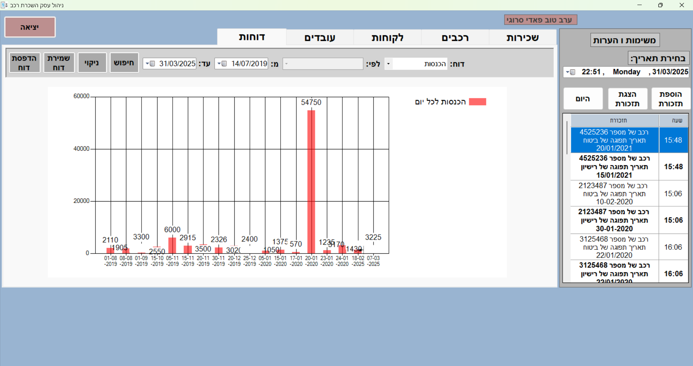
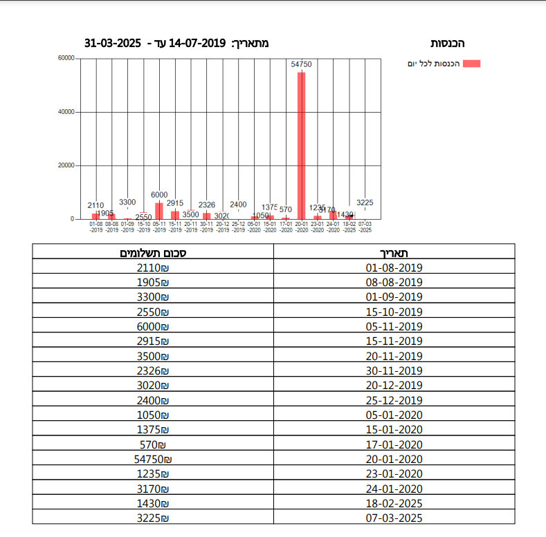

---

### 🔁 Actions Example: Add / Update / Delete (Cars & Clients)

Each tab includes the ability to add, edit, and in some cases delete records with role-based permissions.

**Examples:**
- ➕ Add a new car or client to the system
- ✏️ Update client details like address, phone number, or license
- ❌ Delete outdated cars (only by manager)
- 🖨️ Print reports for external use or archiving

